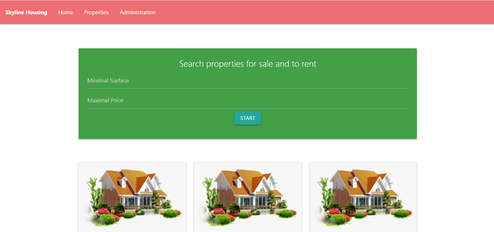

## Introduction

Skyline housing is a dedicated web application for real estate agencies to manage the purchase, sale and rental of real estate

## Informations
-   Status: under development
-   Version 1.0
-   Sector Real esate
-   Created: October 2020
-   Last updated: October 2020

## Table of contents
* [Documentation](#general-info)
* [Demo](#demo)
* [Screenshots](#screenshots)
* [Technologies](#technologies)
* [Setup](#setup)
* [Features](#features)
* [Status](#status)
* [Contact](#contact)
* [License](#license)

## Documentation
https://github.com/aniskchaou/SKYLINE-HOUSING-FRONTOFFICE-BACKOFFICE-USER-ADMIN/wiki

## Demo
https://housing-symfony5.herokuapp.com/

## Screenshots

## Technologies
* PHP
* Symfony

## Setup

## Features
 -  Show the list of property
-   Find properties by criteria
-   Create, update and Delete properties
-   contact user by email

## Contact
contact@delta-dev-software.com

## License
<a href="license.txt">MIT License</a>